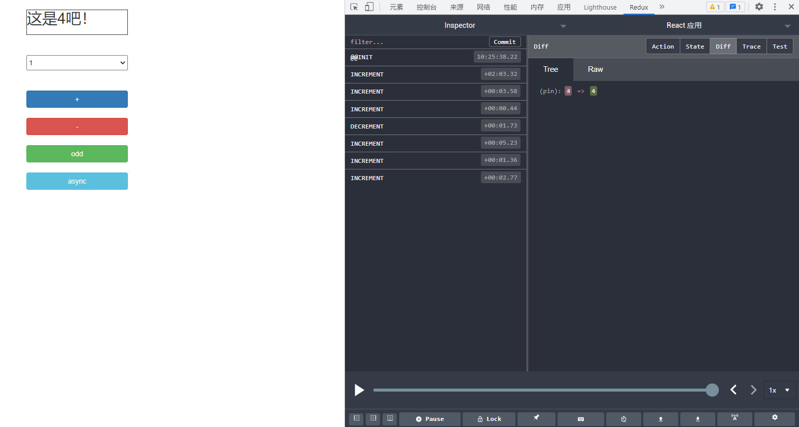
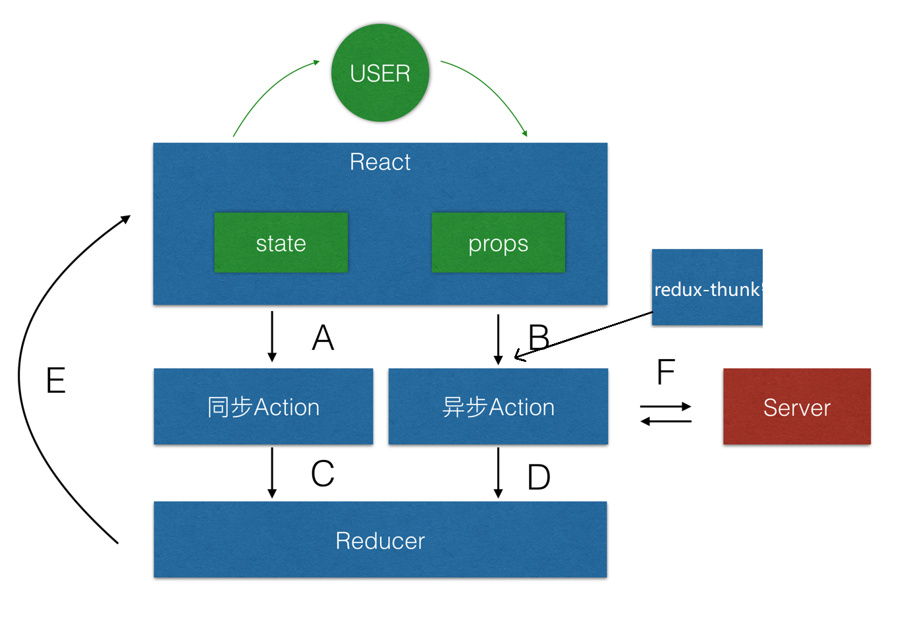

安装项目运行依赖
```
npm install
```
启动并运行项目
```
npm run start
```

项目截图



# 0. redux要点
	1. redux理解
	2. redux相关API
	3. redux核心概念(3个)
	4. redux工作流程
	5. 使用redux及相关库编码

# 1. redux理解
	什么?: redux是专门做状态管理的独立第3方库, 不是react插件
	作用?: 对应用中状态进行集中式的管理(写/读)
	开发: 与react-redux, redux-thunk等插件配合使用

# 2. redux相关API
	redux中包含: createStore(), applyMiddleware(), combineReducers()
	store对象: getState(), dispatch(), subscribe()
	react-redux: <Provider>, connect()()

# 3. redux核心概念(3个)
	action: 
		默认是对象(同步action), {type: 'xxx', data: value}, 需要通过对应的actionCreator产生, 
		它的值也可以是函数(异步action), 需要引入redux-thunk才可以
	reducer
		根据老的state和指定的action, 返回一个新的state
		不能修改老的state
	store
		redux最核心的管理对象
		内部管理着: state和reducer
		提供方法: getState(), dispatch(action), subscribe(listener)

# 4. redux工作流程



		
# 5. 使用redux及相关库编码
```
	需要引入的库: 
		redux
		react-redux
		redux-thunk
		redux-devtools-extension(这个只在开发时需要)
	redux文件夹: 
		action-types.js
		actions.js
		reducers.js
		store.js
	组件分2类: 
		ui组件(components): 不使用redux相关PAI
		容器组件(containers): 使用redux相关API
```
# 6. 相关
### 问题
1) redux 与 react 组件的代码耦合度太高
2) 编码不够简洁

### react-redux

理解
1) 一个 react 插件库
2) 专门用来简化 react 应用中使用 redux

React-Redux 将所有组件分成两大类

1) UI 组件
```
a. 只负责 UI 的呈现，不带有任何业务逻辑

b. 通过 props 接收数据(一般数据和函数)

c. 不使用任何 Redux 的 API

d. 一般保存在 components 文件夹下
```
2) 容器组件
```
a. 负责管理数据和业务逻辑，不负责 UI 的呈现

b. 使用 Redux 的 API

c. 一般保存在 containers
```
**相关 API**

1) Provider

```
让所有组件都可以得到 state 数据

<Provider store={store}>
<App />
</Provider>
```
2) connect()

```
用于包装 UI 组件生成容器组件

import { connect } from 'react-redux'
connect(
mapStateToprops,
mapDispatchToProps)(Counter)
```

3) mapStateToprops()

```
将外部的数据（即 state 对象）转换为 UI 组件的标签属性

const mapStateToprops = function (state) {
return {
value: state
}
}
```
4) mapDispatchToProps()
```
将分发 action 的函数转换为 UI 组件的标签属性

简洁语法可以直接指定为 actions 对象或包含多个 action 方法的对象
```
### 使用 react-redux
1) 下载依赖包
```
npm install --save react-redu
```

### redux 异步编程

问题
1) redux 默认是不能进行异步处理的
2) 应用中又需要在 redux 中执行异步任务(ajax, 定时器)

下载 redux 插件(异步中间件)
```
npm install --save redux-thunk
```


### 使用上 redux 调试工具
```
安装 chrome 浏览器插件 redux-devtools
```

下载工具依赖包
```
npm install --save-dev redux-devtools-extension
```
react应用内编码
```
import { composeWithDevTools } from 'redux-devtools-extension'
const store = createStore(
counter,
composeWithDevTools(applyMiddleware(thunk))
)
```