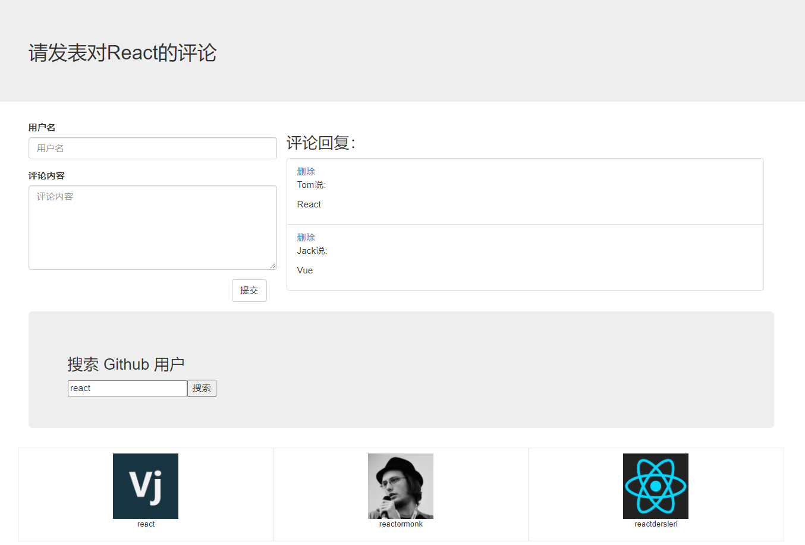

#### 使用React 做的两个小案例
基于React 脚手架

一：评论添加与删除
- 把该项目拆分成了四个组件APP、Add、List、Item
- 使用受控组件的方式获取输入框中的值
- 父子组件之间的传值
- 使用了bootstrap 和少量自定义样式美化界面

二：输入关键字调用GitHub API搜索用户
- 把该项目拆分为三个组件APP、Search、Main
- 使用受控组件的方式获取输入框中的值
- 兄弟组件之间的传值问题
- 使用 pubsub-js 库实现发布-订阅模式的消息传递  
- 使用axios 调用GitHub API获取搜索数据

